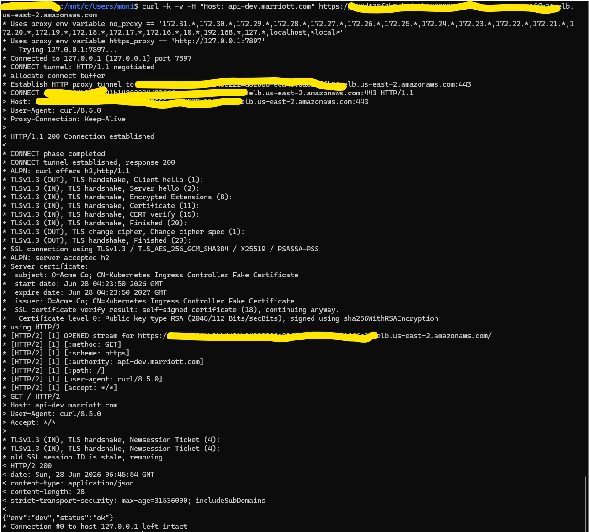
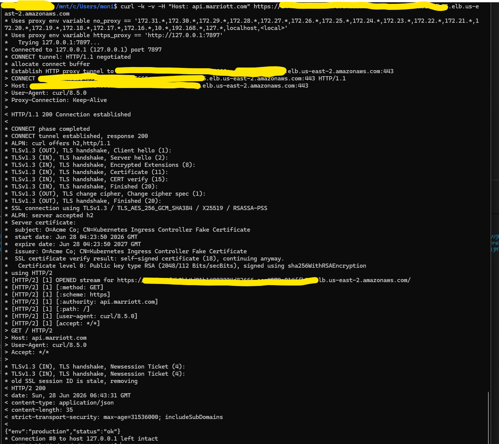

# Kubernetes Manifests

This directory contains a Kustomize layout for a single API server deployed to multiple environments.

## Structure

- `base`: shared manifests for the API deployment, service, ingress, and namespace template.
- `overlays/dev`: development-specific namespace, config, image tag, replica count, and ingress host.
- `overlays/qa`: internal QA environment.
- `overlays/perf`: performance test environment with higher baseline capacity.
- `overlays/staging`: pre-production integration and UAT environment.
- `overlays/production`: production environment with the highest baseline replica and resource settings.


## Build And Apply

Render a specific environment, for example development:

```powershell
kustomize build k8s/overlays/dev
```

Apply the development manifests:

```powershell
kubectl apply -k k8s/overlays/dev
```

Repeat the same pattern for `qa`, `perf`, `staging`, and `production`.

## CI/CD Pipeline

The Jenkins pipeline is defined in `app/Jenkinsfile`.

- Builds and smoke-tests the Flask API.
- Validates all Kustomize overlays.
- Builds and pushes the container image.
- Deploys automatically to `dev` and `qa`.
- Requires manual approval before `perf`, `staging`, and `production`.
- Uses `kubectl rollout status` to block on failed rollouts.

## Result


